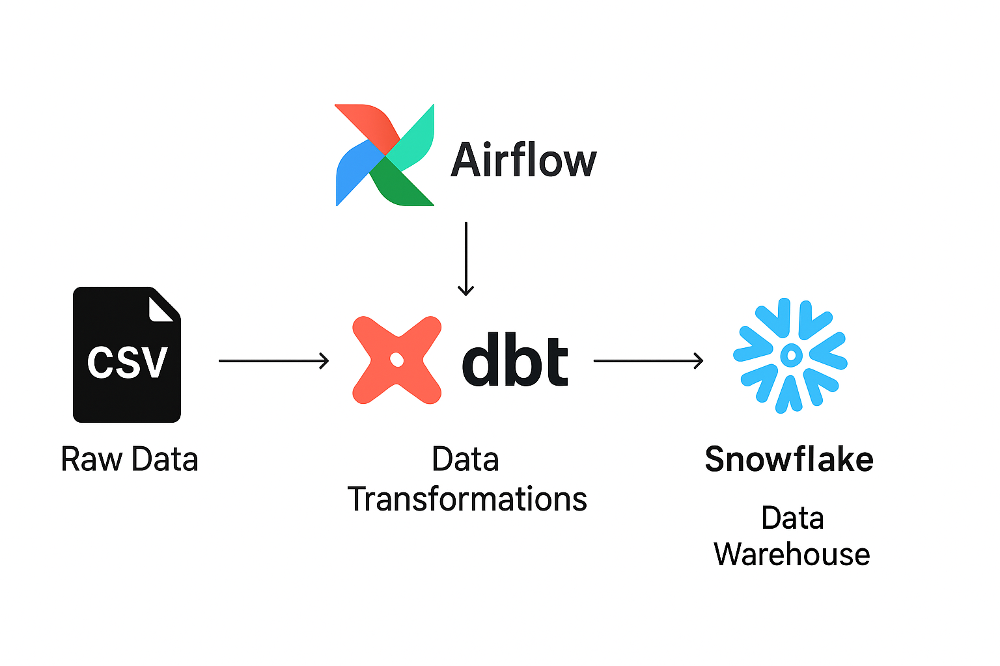
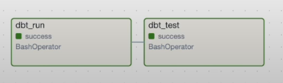
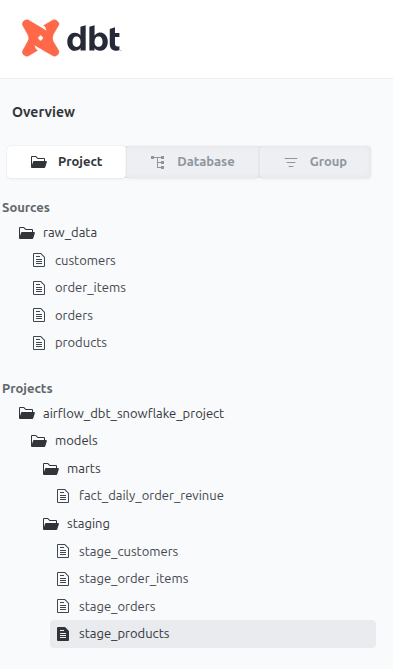

# Airflow + dbt + Snowflake Data Pipeline   

##  Overview  
This project demonstrates a **modern data engineering pipeline** built with:  
- **Snowflake** → Cloud-based Data Warehouse for scalable storage and querying.  
- **dbt (Data Build Tool)** → For data transformations, modeling, and testing.  
- **Apache Airflow** → For orchestration and scheduling of data workflows.  

The pipeline ingests raw CSV files, loads them into Snowflake, transforms the data using **dbt models**, and schedules the execution using **Airflow DAGs**.  

The goal is to showcase how to build a **production-ready ELT pipeline** with modular, scalable, and testable components.  

---

##  Architecture  

1. **Data Source**: Raw CSV files (customers, orders, order_items, products).  
2. **Snowflake**: Used as the centralized data warehouse (`finance_db`).  
3. **dbt**:  
   - **Staging Models**: Clean and standardize raw data.  
   - **Marts Models**: Create business-level models (e.g., fact tables).  
   - **Tests**: Ensure data quality and integrity.  
4. **Airflow**: Orchestrates the pipeline via a DAG:  
   - `dbt_run` → executes transformations.  
   - `dbt_test` → validates results.  

---

##  Repository Structure  

```

├── Data\_Files/                   # Raw CSVs for ingestion
├── analyses/                      # dbt analyses (optional queries)
├── dbt\_internal\_packages/
├── images/                        # Project screenshots (DAG, dbt lineage, etc.)
├── logs/                          # Airflow/dbt logs
├── macros/                        # dbt macros
├── models/                        # Core dbt models
│   ├── marts/                     # Business logic models
│   │   └── fact\_daily\_order\_revenue.sql
│   └── staging/                   # Staging/cleaning models
│       ├── stage\_customers.sql
│       ├── stage\_orders.sql
│       ├── stage\_order\_items.sql
│       └── stage\_products.sql
├── seeds/                         # CSV seeds to load into dbt
├── snapshots/                     # dbt snapshots (history tracking)
├── target/                        # dbt compiled code + run artifacts
├── tests/                         # dbt tests
├── dag\_script.py                 # Airflow DAG (runs dbt run + dbt test)
├── dbt\_project.yml               # dbt project configuration
├── snowflake\_script.sql          # Snowflake schema setup
└── README.md                      # Project documentation

````

---

##  Setup Instructions  

### 1. Clone Repository  
```bash
git clone https://github.com/keroloshany47/snowflake_dbt_airflow_project.git
cd snowflake_dbt_airflow_project
````

### 2. Snowflake Setup

Run the `snowflake_script.sql` in your Snowflake account to create:

* Database: `finance_db`
* Schema: `raw`
* Warehouse: `finance_wh`
* Role: `ACCOUNTADMIN`

Update your credentials in the dbt profile:

```yaml
snowflake_project:
  outputs:
    dev:
      account: <your_snowflake_account>
      database: finance_db
      user: dbt_user
      password: <your_password>
      warehouse: finance_wh
      role: ACCOUNTADMIN
      schema: raw
      type: snowflake
  target: dev
```

### 3. dbt Setup

Install dependencies and run models locally:

```bash
dbt deps
dbt seed
dbt run
dbt test
```

### 4. Airflow Setup

If you’re running locally:

```bash
airflow db init
airflow webserver --port 8080
airflow scheduler
```

Then copy the `dag_script.py` into your Airflow `dags/` folder.

The DAG will:

1. Run dbt transformations (`dbt run`)
2. Validate with tests (`dbt test`)

Open Airflow UI → Trigger the DAG manually or set a schedule.

---

##  DAG & dbt doc

### Airflow DAG



### dbt doc



---

##  Example Use Case

* **Input**: CSV files with raw customer & order data.
* **Process**: dbt cleans and transforms data into staging → fact tables.
* **Output**: Fact table `fact_daily_order_revenue` in Snowflake for BI/reporting.

---
 

##  Contact  

For any questions or collaboration opportunities, feel free to reach out:  

- **Email**: keroloshani474@gmail.com  
- **LinkedIn**: [linkedin.com/in/kerolos-hani-data](https://www.linkedin.com/in/keroloshani-data/)  
- **GitHub**: [github.com/keroloshany47](https://github.com/keroloshany47)  

